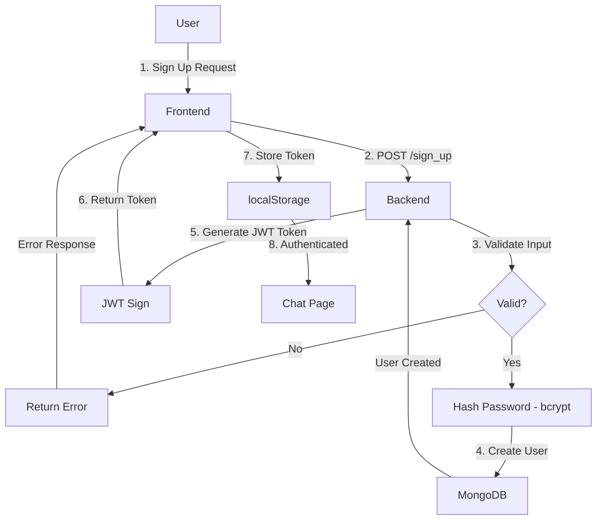
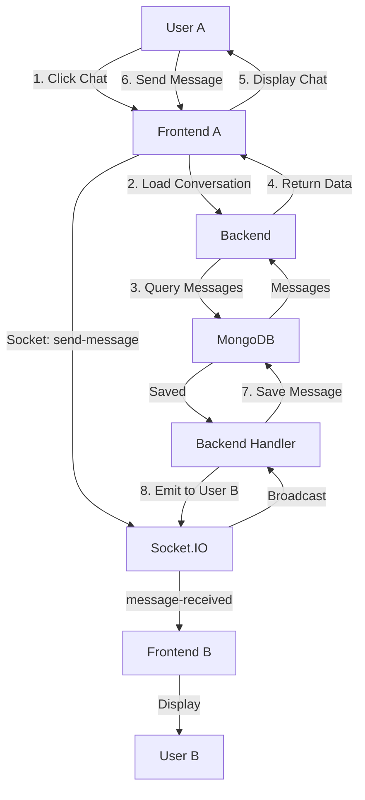
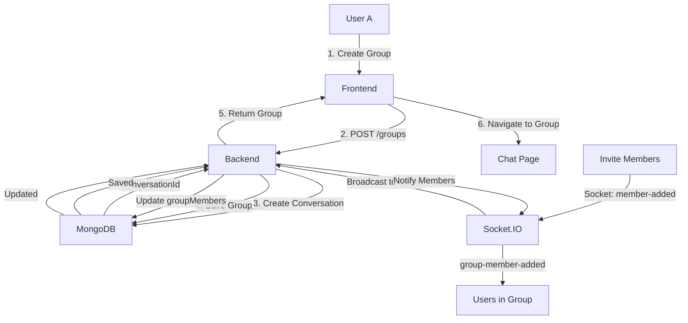

# Chit-Chat: Real-Time Messaging Application

A full-stack real-time messaging platform with user authentication, direct chats, group messaging, and media sharing capabilities.

## � Live Demo

🌐 **Frontend:** https://chit-chat-1iab.vercel.app/  
🔌 **Backend API:** https://chit-chat-lu1k.onrender.com  

**Try it now:** [Open Chit-Chat](https://chit-chat-1iab.vercel.app/)

---

## �📋 Table of Contents

- [Overview](#overview)
- [Tech Stack](#tech-stack)
- [Project Architecture](#project-architecture)
- [Database Schema](#database-schema)
- [API Endpoints](#api-endpoints)
- [Socket.IO Events](#socketio-events)
- [Workflows](#workflows)
- [Setup & Installation](#setup--installation)
- [Running Locally](#running-locally)
- [Deployment](#deployment)
- [Testing](#testing)

---

## 🎯 Overview

**Chit-Chat** is a real-time messaging application that allows users to:

- ✅ Register and authenticate with JWT tokens
- ✅ Create direct conversations with other users
- ✅ Create and manage group chats
- ✅ Send text, image, and file messages
- ✅ Receive real-time message updates via WebSocket (Socket.IO)
- ✅ Upload media to Cloudinary
- ✅ Manage friend requests and relationships
- ✅ Track online/offline status
- ✅ Mark messages as read/delivered

---

## 🛠 Tech Stack

### Backend
- **Runtime:** Node.js + Express.js
- **Language:** TypeScript
- **Database:** MongoDB (Atlas)
- **Real-time Communication:** Socket.IO
- **Authentication:** JWT (JSON Web Tokens)
- **Media Upload:** Cloudinary
- **Validation:** Zod
- **Password Hashing:** Bcrypt

### Frontend
- **Framework:** React 19 + TypeScript
- **Build Tool:** Vite
- **Styling:** Tailwind CSS
- **API Client:** Axios
- **Real-time Client:** Socket.IO Client
- **Routing:** React Router v7
- **Forms:** React Hook Form
- **UI Components:** Lucide React Icons
- **Notifications:** React Toastify
- **Emoji Picker:** emoji-picker-react

### Deployment
- **Backend:** Render.com (Node.js)
- **Frontend:** Vercel
- **Database:** MongoDB Atlas
- **Media Storage:** Cloudinary

---

## 🏗 Project Architecture

### System Architecture Diagram

```
┌─────────────────────────────────────────────────────────────────────┐
│                         CHIT-CHAT APPLICATION                        │
├──────────────────────────────┬──────────────────────────────────────┤
│                              │                                        │
│        FRONTEND (Vercel)      │         BACKEND (Render)             │
│  ┌──────────────────────┐     │    ┌──────────────────────────┐     │
│  │  React + TypeScript  │     │    │  Node.js + Express       │     │
│  │  ├─ Pages            │     │    │  ├─ Auth Routes         │     │
│  │  │  ├─ Sign_In       │     │    │  │  ├─ /sign_up        │     │
│  │  │  ├─ Register      │     │    │  │  ├─ /sign_in        │     │
│  │  │  ├─ Chat          │     │    │  │  ├─ /logout         │     │
│  │  │  ├─ Profile       │     │    │  │  └─ /verify         │     │
│  │  │  ├─ FriendsManager│     │    │  ├─ Chat Routes       │     │
│  │  │  └─ SearchUsers   │     │    │  │  ├─ GET /conv...   │     │
│  │  │                   │     │    │  │  ├─ POST /conv...  │     │
│  │  ├─ Components       │     │    │  │  └─ GET /messages  │     │
│  │  │  ├─ ChatUI        │     │    │  ├─ Group Routes    │     │
│  │  │  ├─ GroupInfo     │     │    │  │  ├─ POST /create  │     │
│  │  │  └─ CreateGroupMod│     │    │  │  ├─ PUT /:id      │     │
│  │  ├─ Socket.IO        │────────→ │  │  └─ DELETE /:id   │     │
│  │  │  └─ WebSocket     │ (WS)│    │  └─ Socket Handlers   │     │
│  │  └─ API Config       │────────→ │     ├─ chatHandler    │     │
│  │     └─ Axios         │ (REST)   │     └─ Room Events   │     │
│  └──────────────────────┘     │    └──────────────────────────────┘
│                              │           ↓            ↓
└──────────────────────────────┼───────────┤────────────┤─────────────┘
                               │           │            │
                       ┌───────▼───┐  ┌────▼──┐  ┌────▼──────┐
                       │  MongoDB  │  │Cloudinary│  │JWT Secret │
                       │  Database │  │  Media  │  │Config    │
                       └───────────┘  └─────────┘  └──────────┘
```

---

## 📊 Database Schema

### Data Models & Relationships

```
┌──────────────────────────────────────────────────────────────────────┐
│                      DATA MODEL RELATIONSHIPS                         │
├──────────────────────────────────────────────────────────────────────┤
│                                                                        │
│  ┌─────────────────┐              ┌──────────────────┐              │
│  │      USER       │              │   CONVERSATION   │              │
│  │─────────────────│              │──────────────────│              │
│  │ • _id           │◄─────────┐   │ • _id            │              │
│  │ • username      │          │   │ • participants[]│◄─────┐       │
│  │ • email         │          │   │ • conversationType      │       │
│  │ • password      │          │   │ • groupName      │      │       │
│  │ • profilePic    │          │   │ • groupAvatar    │      │       │
│  │ • statusText    │          │   │ • groupMembers[]│      │       │
│  │ • onlineStatus  │          │   │ • lastMessageId │      │       │
│  │ • lastSeen      │          │   │ • unreadCount    │      │       │
│  │ • friends[]     │          │   │ • createdAt      │      │       │
│  │ • friendReq[]   │          │   │ • updatedAt      │      │       │
│  │ • tokenVersion  │          │   │                  │      │       │
│  └─────────────────┘          │   └──────────────────┘      │       │
│           │                    │           │                 │       │
│           │                    └───────────┘                 │       │
│           │                                                  │       │
│      (friends)                      ┌──────────────────┐     │       │
│      (requests)                     │     MESSAGE      │     │       │
│           │                         │──────────────────│     │       │
│           └──────────────────────→  │ • _id            │     │       │
│                                     │ • conversationId │◄────┘       │
│                                     │ • senderId       │─────┐       │
│                                     │ • content        │     │       │
│                                     │ • messageType    │     │       │
│                                     │ • mediaUrl       │     │       │
│                                     │ • deliveryStatus │     └──USER │
│                                     │ • readBy[]       │             │
│                                     │ • reactions[]    │             │
│                                     │ • isEdited       │             │
│                                     │ • isDeleted      │             │
│                                     │ • replyTo        │             │
│                                     │ • sentAt         │             │
│                                     │ • readAt         │             │
│                                     └──────────────────┘             │
│                                      (references)                     │
│                                                                        │
│  ┌──────────────┐                                                    │
│  │    GROUP     │                                                    │
│  │──────────────│                                                    │
│  │ • _id        │                                                    │
│  │ • name       │                                                    │
│  │ • desc       │                                                    │
│  │ • adminId    │──────→ USER                                       │
│  │ • memberIds[]│──────→ USER[]                                     │
│  │ • picture    │                                                    │
│  │ • conv_id    │──────→ CONVERSATION                               │
│  │ • createdAt  │                                                    │
│  └──────────────┘                                                    │
│                                                                        │
└──────────────────────────────────────────────────────────────────────┘
```

---

## 🔌 API Endpoints

### Authentication Routes (`/api/auth`)

| Method | Endpoint | Auth | Description |
|--------|----------|------|-------------|
| POST | `/sign_up` | ❌ | Register new user |
| POST | `/sign_in` | ❌ | Login user |
| POST | `/logout` | ✅ | Logout and invalidate token |
| POST | `/refresh` | ✅ | Refresh JWT token |
| GET | `/verify` | ✅ | Verify token validity |

### Chat Routes (`/api/chat`)

| Method | Endpoint | Auth | Description |
|--------|----------|------|-------------|
| GET | `/conversations` | ✅ | Get all user conversations |
| POST | `/conversations` | ✅ | Create new conversation |
| GET | `/conversations/:conversationId` | ✅ | Get conversation details |
| GET | `/conversations/:conversationId/messages` | ✅ | Get conversation messages |
| PUT | `/conversations/:conversationId/read` | ✅ | Mark conversation as read |
| PUT | `/messages/:messageId` | ✅ | Edit message |
| DELETE | `/messages/:messageId` | ✅ | Delete message |

### Group Routes (`/api/groups`)

| Method | Endpoint | Auth | Description |
|--------|----------|------|-------------|
| POST | `/` | ✅ | Create group |
| GET | `/conversation/:conversationId` | ✅ | Get group by conversation |
| GET | `/:groupId` | ✅ | Get group details |
| PUT | `/:groupId` | ✅ | Update group (name, pic, desc) |
| DELETE | `/:groupId` | ✅ | Delete group |
| GET | `/:groupId/messages` | ✅ | Get group messages |
| POST | `/:groupId/members` | ✅ | Add members to group |
| DELETE | `/:groupId/members/:userId` | ✅ | Remove member from group |
| POST | `/:groupId/leave` | ✅ | Leave group |
| PUT | `/:groupId/admin` | ✅ | Transfer admin rights |

---

## 🔄 Workflows

### 1. User Authentication Flow



### 2. Direct Message Flow



### 3. Group Chat Creation



---

## 📦 Deployment

### ✅ Deployed & Live

- **Frontend:** https://chit-chat-1iab.vercel.app/
- **Backend API:** https://chit-chat-lu1k.onrender.com

### Backend: Render.com

1. **Connect GitHub** to Render
2. **Create Web Service** from `chit-chat` repo
3. **Set Root Directory:** `backend/`
4. **Build Command:** `npm install && npm run build`
5. **Start Command:** `npm run start`
6. **Add Environment Variables:**
   - `NODE_ENV=production`
   - `MONGO_URI=<mongodb_atlas_uri>`
   - `JWT_SECRET=<strong_secret>`
   - `FRONTEND=https://your-vercel-url.vercel.app`
   - `CLOUDINARY_CLOUD_NAME=<your_cloud_name>`
   - `CLOUDINARY_API_KEY=<your_key>`
   - `CLOUDINARY_API_SECRET=<your_secret>`

7. **Deploy** - Render auto-deploys on push

### Frontend: Vercel

1. **Go to vercel.com** → Import Project
2. **Select Repository** and set **Root Directory:** `frontend/`
3. **Build Settings:**
   - Build Command: `npm run build`
   - Output Directory: `dist`
4. **Environment Variables:**
   - `VITE_API_BASE_URL=https://your-render-api.onrender.com/api`
   - `VITE_SOCKET_URL=https://your-render-api.onrender.com`
5. **Deploy** - Vercel auto-deploys on push

---

## 🚀 Running Locally

### Backend

```bash
cd backend
npm install
npm run dev
# Server on http://localhost:5000
```

### Frontend

```bash
cd frontend
npm install
npm run dev
# App on http://localhost:5173
```

### Environment Files

**backend/.env.development:**
```env
NODE_ENV=development
PORT=5000
MONGO_URI=<your_mongodb_uri>
JWT_SECRET=dev_secret_key
FRONTEND=http://localhost:5173,http://localhost:3000
CLOUDINARY_CLOUD_NAME=<your_cloud_name>
CLOUDINARY_API_KEY=<your_key>
CLOUDINARY_API_SECRET=<your_secret>
```

**frontend/.env.development:**
```env
VITE_API_BASE_URL=http://localhost:5000/api
VITE_SOCKET_URL=http://localhost:5000
```

---

## 🧪 Testing

### Checklist

- [ ] Sign up / Sign in
- [ ] Send direct message
- [ ] Message displays in real-time
- [ ] Create group
- [ ] Add members to group
- [ ] Group message broadcasts
- [ ] Upload image to Cloudinary
- [ ] Edit/delete message
- [ ] User online/offline status
- [ ] Mark message as read

See [backend/test/TESTING.md](backend/test/TESTING.md) for detailed API testing instructions.

---

## 📁 Project Structure

```
chit-chat/
├── backend/
│   ├── src/
│   │   ├── config/        # DB config, env vars
│   │   ├── controllers/   # Business logic
│   │   ├── middleware/    # Auth, error handling
│   │   ├── models/        # MongoDB schemas
│   │   ├── routes/        # API routes
│   │   ├── socket/        # Socket.IO handlers
│   │   ├── lib/           # Utilities
│   │   └── types.ts       # TypeScript types
│   ├── index.ts           # Server entry point
│   └── package.json
│
├── frontend/
│   ├── src/
│   │   ├── api/           # Axios config
│   │   ├── components/    # React components
│   │   ├── context/       # React Context
│   │   ├── pages/         # Route pages
│   │   ├── socket/        # Socket.IO client
│   │   └── types.ts       # TypeScript types
│   ├── index.html
│   ├── package.json
│   └── vite.config.ts
│
└── README.md              # This file
```

---

## 🔐 Security

- ✅ Passwords hashed with bcrypt
- ✅ JWT authentication on protected routes
- ✅ CORS configured for frontend domain
- ✅ Input validation with Zod
- ✅ Cloudinary secrets on backend only

---

## 📚 Resources

- [Express.js Docs](https://expressjs.com/)
- [React Docs](https://react.dev/)
- [Socket.IO Docs](https://socket.io/)
- [MongoDB Docs](https://docs.mongodb.com/)
- [Vite Docs](https://vite.dev/)

---

**Status:** ✅ Live on Render + Vercel  
**Frontend:** https://chit-chat-1iab.vercel.app/  
**Backend:** https://chit-chat-lu1k.onrender.com  
**Last Updated:** February 18, 2026