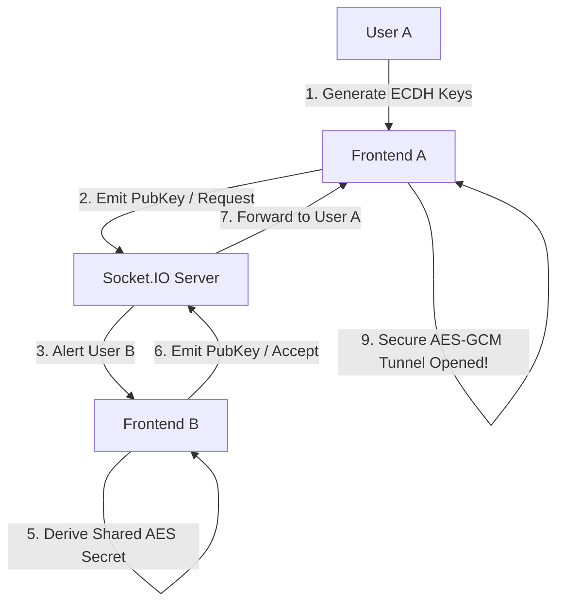
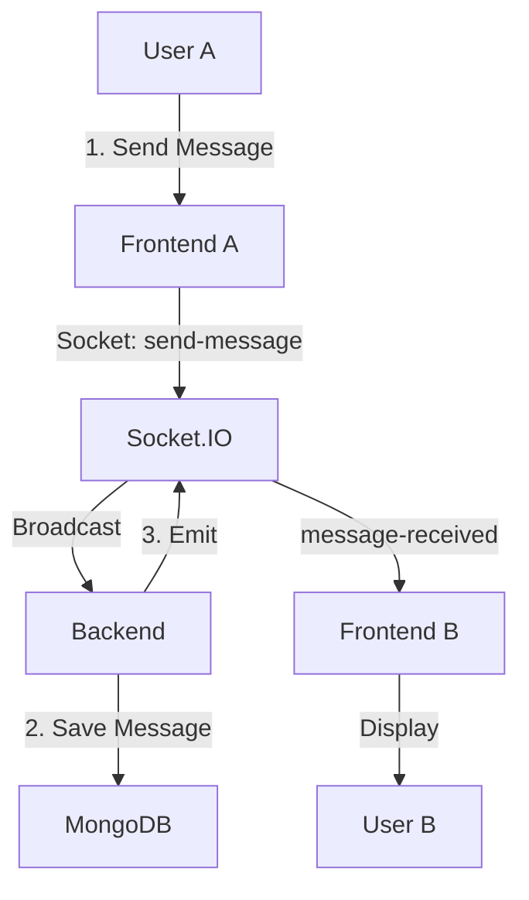

# Chit-Chat 💬: Real-Time Messaging Application

A full-stack, hyper-minimalist real-time messaging platform prioritizing seamless user experience, direct chats, group messaging, and hyper-secure, end-to-end encrypted (E2EE) secret conversations.

## 🌐 Live Demo

🔗 **Frontend:** https://chit-chat-1iab.vercel.app/  
🔌 **Backend API:** https://chit-chat-lu1k.onrender.com  

**Try it now:** [Open Chit-Chat](https://chit-chat-1iab.vercel.app/)

---

## 📋 Table of Contents

- [Overview](#overview)
- [Tech Stack](#tech-stack)
- [Project Architecture](#project-architecture)
- [Database Schema](#database-schema)
- [API Endpoints](#api-endpoints)
- [Workflows](#workflows)
- [Setup & Installation](#setup--installation)
- [Running Locally](#running-locally)
- [Deployment](#deployment)
- [Testing](#testing)

---

## 🎯 Overview

**Chit-Chat** is a state-of-the-art messaging application featuring a modern monochromatic UI, allowing users to:

- ✅ **E2E Encrypted Secret Chats:** In-memory, ephemeral secure tunnels utilizing native browser Web Crypto API (ECDH, AES-GCM).
- ✅ **Auto-Destructing Messages:** TTL (Time-To-Live) indexing automatically destroys secret messages 1 minute after reads.
- ✅ **Real-Time Communication:** Instant messaging with accurate delivery/read receipts via Socket.IO.
- ✅ Register and authenticate securely with JWT tokens.
- ✅ Create direct conversations and rich media group chats.
- ✅ Share images automatically optimized via Cloudinary.
- ✅ Toggle a true-contrast Minimalist Dark/Light Mode.

---

## 🛠 Tech Stack

### Backend
- **Runtime:** Node.js + Express.js
- **Language:** TypeScript
- **Database:** MongoDB (Atlas)
- **Real-time Communication:** Socket.IO
- **Authentication:** JWT
- **Media Upload:** Cloudinary
- **Validation:** Zod
- **Security:** Bcrypt (Hashing)

### Frontend
- **Framework:** React 19 + TypeScript
- **State/Crypto:** React Context API + Native `window.crypto.subtle` API
- **Build Tool:** Vite
- **Styling:** Tailwind CSS (Monochrome Apple-style Theme)
- **API Client:** Axios
- **Routing:** React Router v7
- **UI Components:** Lucide React Icons

---

## 🏗 Project Architecture

### System Architecture Diagram

```
┌─────────────────────────────────────────────────────────────────────┐
│                         CHIT-CHAT APPLICATION                        │
├──────────────────────────────┬──────────────────────────────────────┤
│                              │                                      │
│        FRONTEND (Vercel)     │         BACKEND (Render)             │
│  ┌──────────────────────┐    │    ┌──────────────────────────┐      │
│  │  React + TypeScript  │    │    │  Node.js + Express       │      │
│  │  ├─ Context          │    │    │  ├─ Auth Routes          │      │
│  │  │  └─ SecretChatCtx │    │    │  ├─ Chat Routes          │      │
│  │  ├─ Pages / UI       │    │    │  ├─ Group Routes         │      │
│  │  │  ├─ Chat          │    │    │  └─ Socket Handlers      │      │
│  │  │  ├─ SecretChatUI  │    │    │     ├─ chatHandler       │      │
│  │  │  └─ Profile       │    │    │     └─ secretChatHandler │      │
│  │  ├─ Socket.IO        │───→│    └──────────────────────────┘      │
│  │  │  └─ WebSocket     │(WS)│           ↓            ↓             │
│  │  └─ API Config       │───→│           │            │             │
│  └──────────────────────┘    │           │            │             │
└──────────────────────────────┼───────────┤────────────┤─────────────┘
                               │           │            │
                       ┌───────▼───┐  ┌────▼──┐  ┌────▼──────┐
                       │  MongoDB  │  │Cloudy │  │JWT Secret │
                       │  Database │  │ Media │  │Config     │
                       └───────────┘  └───────┘  └───────────┘
```

---

## 📊 Database Schema

### Data Models & Relationships

```
┌──────────────────────────────────────────────────────────────────────┐
│                      DATA MODEL RELATIONSHIPS                        │
├──────────────────────────────────────────────────────────────────────┤
│                                                                      │
│  ┌─────────────────┐             ┌──────────────────┐                │
│  │      USER       │◄────────┐   │   CONVERSATION   |                │
│  │─────────────────│         │   │──────────────────│                │
│  │ • _id           │         └───│ • participants[] │                │
│  │ • username      │             │ • groupMembers[] │                │
│  │ • activeStatus  │             └──────────────────┘                │
│  └─────────────────┘                      │                          │
│           │                               │                          │
│           │                       ┌──────────────────┐               │
│           │                       │     MESSAGE      │               │
│           │                       │──────────────────│               │
│           └──────────────────────→│ • _id            │               │
│                                   │ • conversationId │               │
│                                   │ • senderId       │               │
│                                   │ • content        │               │
│                                   └──────────────────┘               │
│                                                                      │
│  ┌──────────────────┐             ┌────────────────────┐             │
│  │ SECRET_MESSAGE   │             │ SECRET_CONVERSATION|             │
│  │──────────────────│             │────────────────────│             │
│  │ • _id            │             │ • _id              │             │
│  │ • conversationId │◄────────────│ • initiatorId      │             │
│  │ • senderId       │             │ • recipientId      │             │
│  │ • content (Encr) │             │ • status           │             │
│  │ • iv (Base64)    │             └────────────────────┘             │
│  │ • expiresAt (TTL)│                                                │
│  └──────────────────┘                                                │
└──────────────────────────────────────────────────────────────────────┘
```

---

## 🔌 API Endpoints & Sockets

Detailed implementation exists for standard Chat APIs (`/api/chat`, `/api/groups`). 

### Ephemeral Secret Chat Events (`secretChatHandler`)
- `secret-chat-request`: Initiates ECDH public key exchange.
- `secret-chat-accept`: Completes exchange, establishes room.
- `send-secret-message`: Dispatches AES-encrypted ciphertexts.
- `secret-message-status-updated`: Marks as read, triggers DB 1-minute TTL index.
- `secret-chat-partner-disconnected`: Triggers secure 10s auto-destruct on client drop.

---

## 🔄 Workflows

### 1. End-To-End Encrypted Handshake (Web Crypto API)


```mermaid
graph TD
    A[User A] -->|1. Generate ECDH Keys| B[Frontend A]
    B -->|2. Emit PubKey / Request| C[Socket.IO Server]
    C -->|3. Alert User B| D[Frontend B]
    D -->|4. Generate ECDH Keys| D
    D -->|5. Derive Shared AES Secret| D
    D -->|6. Emit PubKey / Accept| C
    C -->|7. Forward to User A| B
    B -->|8. Derive Shared AES Secret| B
    B -->|9. Secure AES-GCM Tunnel Opened!| B
```

### 2. Standard Message Flow


```mermaid
graph TD
    A[User A] -->|1. Send Message| B[Frontend A]
    B -->|Socket: send-message| E[Socket.IO]
    E -->|Broadcast| F[Backend]
    F -->|2. Save Message| D[MongoDB]
    F -->|3. Emit | E
    E -->|message-received| G[Frontend B]
    G -->|Display| H[User B]
```

---

## 📦 Deployment

### Backend: Render.com
Deployed securely using Node.js environment variables. Uses MongoDB Atlas for persistence and TTL message removal. Configured with native CORS wrapping exclusively allowing the Vercel frontend.

### Frontend: Vercel
Deployed as a Vite React Single Page Application (SPA), dynamically talking to standard HTTP servers and WebSocket endpoints simultaneously. 

---

## 🚀 Running Locally

### Backend
```bash
cd backend
npm install
npm run dev
# Server on http://localhost:5000
```

### Frontend
```bash
cd frontend
npm install
npm run dev
# App on http://localhost:5173
```

*(Ensure `.env.development` files map MongoDB URI, Cloudinary Secrets, and JWT constraints before running)*

---

## 🔐 Security Standards

- ✅ **Cryptography:** ECDH (P-256) + AES-GCM (256-bit) zero-knowledge message structures. Keys are purely ephemeral and strictly memory-resident.
- ✅ Passwords securely hashed with `bcrypt`.
- ✅ JWT authentication applied strict to protected data pathways.
- ✅ Rigorous input sanitization and payload typing dynamically asserted via `Zod`.
- ✅ Hardened socket event validations preventing injection/eavesdropping.

---

**Status:** ✅ Live on Render + Vercel  
**Last Updated:** April 23, 2026